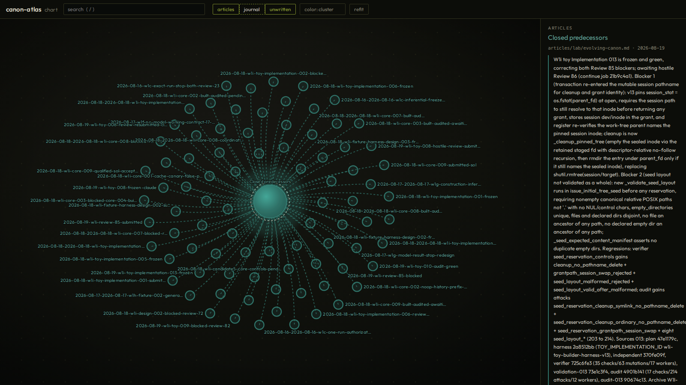

# canon-atlas

An atlas over a catalog of markdown documents that reference each other. Point it at a directory and it draws the whole corpus as a constellation: documents as lit spheres, references as gossamer links, semantic clusters as colored regions of the map. There is no chrome beyond what the map needs: an icon rail on the left owns the panels (documents with search and ordering, the map's clusters and key, and in the app your folders), and a reader on the right opens a tab per document, with editing once a folder or a server backs the page. Every document you open is a browser history entry, so back and forward walk the trail of articles you read, and a hierarchical address renders as breadcrumbs above the document.

It is agnostic to what wrote the catalog. It was built as the human viewport onto [pi-canon](https://github.com/shaneconner/pi-canon) project memory, where mutable articles carry current ground truth and an immutable journal carries the journey to it, but any folder of markdown with `[[wikilinks]]` or relative links works: an Obsidian vault, a wiki, a notes directory, an agent memory store.



## Quick start

```sh
npx canon-atlas open           # open the atlas in your browser; pick folders in the page
npx canon-atlas embed .        # write embeddings.json, so color means meaning
npx canon-atlas build .        # write atlas.html, one self-contained chart of this folder
npx canon-atlas serve .        # serve the live atlas at http://127.0.0.1:4747/
npx canon-atlas app            # write atlas-app.html, the same app as one file
```

Four ways into the same page.

- **open** is the everyday door, made for a launcher entry: it starts the little localhost host if one is not already running, opens your browser at it, and gets out of the way. Type a project's absolute path in the page and the host reads the corpus itself, remembers the path, and lists it in the folders panel as exactly that path, so ten projects whose stores are all named `.canon` still tell apart at a glance. Picking or dropping a folder works too; every project lives in its own browser tab off the one host. Atlas tabs quietly ping the host, and after a full day with no atlas tab open it exits itself, so nothing lingers. A desktop entry makes it a one-keystroke launch:

  ```ini
  [Desktop Entry]
  Type=Application
  Name=canon-atlas
  Exec=canon-atlas open
  Terminal=false
  ```

- **app** emits the pure-client app itself: one HTML file with the renderer and the whole build pipeline inlined, and no data of its own. Host it anywhere static, or open it straight from disk. Editing uses the File System Access API, which needs Chrome or Edge and an http or https page: browsers block the writable picker on `file://`, and some browsers (Brave, Firefox) ship without the API (Brave re-enables it at `brave://flags/#file-system-access-api`). Everywhere else the page falls back to a read-only folder picker, and a folder dropped anywhere on the page opens too, so the constellation still works from a double-clicked file. Remembered folders label themselves from the corpus (the picker API never reveals paths), and any label can be renamed in the folders panel; a name you type, like the full path, is kept as written. When the page comes from the local `open` host, the path door above does better: the host knows real paths, and its workspaces need no picker at all.
- **build** emits a chart: a single HTML file with the renderer, the graph, and every document inlined. It opens from `file://`, ships as an email attachment, and publishes as a static page. Read only by nature.
- **serve** binds to localhost and puts the corpus behind the same page: create, edit, and delete from the reader panel, with changes on disk immediately. Immutable collections are append-only, so the tool will create a journal entry but never rewrite or delete one.

The **open**, **app**, and **serve** paths build the wire data from the exact same pipeline, so the constellation is identical whether the markdown is read in the browser or by the server.

## Collections

A corpus is described by collections: named groups of documents with their own frontmatter mapping and their own mutability. Without configuration:

- A root holding `articles/` and `journal/` gets the **pi-canon preset**: articles are mutable, the journal is immutable and append-only, `capsule` becomes the summary, a journal entry's `subject` list becomes edges to the articles it concerns, and tags of the form `path:VALUE`, which a migrated store carries as provenance, become source metadata instead of tags.
- Anything else is read as a single mutable collection of notes.

To define your own, put a `canon-atlas.json` at the root:

```json
{
  "title": "team wiki",
  "collections": [
    { "name": "pages", "match": "wiki/" },
    { "name": "decisions", "match": "wiki/adr/", "immutable": true,
      "fields": { "summary": "status", "date": "decided" } }
  ]
}
```

`match` is a directory prefix; the longest prefix claims a file. `fields` maps your frontmatter keys onto the ones the atlas reads: `title`, `tags`, `date`, `summary`, and `refs` (a frontmatter list of documents this one concerns, rendered as edges). Titles fall back to the first heading, then to the path. `immutable` marks a collection append-only and draws its documents as rings instead of spheres.

`reveal` controls whether a collection starts on the map: `"always"` (the default) or `"off"` (`"focus"` is accepted and means the same). A collection is on the map exactly when its row in the map panel's key is on: off means gone, layout included, so a hidden tier claims no empty space and nothing lingers. The pi-canon preset starts the journal off: a hundred immutable event entries are detail on demand, not weather. This is why a large corpus reads as a calm sky.

References that resolve nowhere are not errors: they render as dashed, unwritten nodes, because a name the corpus reaches for but has not written yet is a fact worth seeing. In live mode an unwritten node offers to be written.

### The article schema

A store may carry a `schema.json` beside its collections ([pi-canon](https://github.com/shaneconner/pi-canon) writes one when it creates a store), declaring rules for an article's `capsule`, `title`, and `body`: `required`, `min_chars`, `max_chars`, and a `hint`. The atlas enforces the same contract at every one of its write doors. Enforcement is asymmetric on purpose: a `required` rule rejects a save that touches the field (and everything on create), with nothing written and the editor keeping your text while it tells you what to correct; every other rule warns, and a document already in violation shows heal notes in the reader instead of errors, so a body edit is never held hostage to a legacy omission. A malformed `schema.json` fails open and loud: nothing is enforced, and the map panel and every save say so, because a contract the owner believes is enforced while a typo disabled it is the worst state.

## Color

Color is the cluster a document belongs to, sampled from one perceptual ramp (Batlow), and the force layout pulls each cluster into its own region, so a band of the palette and a region of the map mean the same thing.

Clusters come from the best signal available:

- **Embeddings**, when the root holds an `embeddings.json` mapping each document path to a vector. Spherical k-means picks the cluster count by silhouette. Bring vectors from any model; the file is the interface.

  ```json
  { "articles/core.md": [0.021, -0.113, ...], "articles/helper.md": [...] }
  ```

  `canon-atlas embed [root]` writes that file for you. It is the one command in the atlas that touches a network, and only the provider named: the default is a local [Ollama](https://ollama.com) (`nomic-embed-text`; `OLLAMA_HOST` overrides the address), so by default nothing leaves the machine. `-m openai` or `-m openai:MODEL` uses the OpenAI API instead, reading `OPENAI_API_KEY` from the environment. Reruns embed only documents whose content changed, drop vectors for deleted documents, and write atomically after every batch, so an interrupted run keeps its progress. A corpus embedded once keeps its recorded model on bare reruns; `-m` switches models and re-embeds everything. A small `__meta__` record inside the file carries the model name and content hashes; readers ignore it.

- **Paths**, when addresses form a real hierarchy (`src/core/config`, `meta/memory/folds/x`): documents cluster by the first path segment, labeled by the segment itself. A hierarchical store names its own neighborhoods.

- **Link structure** otherwise: deterministic greedy modularity over the reference graph, at zero cost, fully offline.

The map panel can also color by collection or by tag.

Labels reveal progressively with zoom: the most central documents keep their names at any distance, and the rest earn them as you approach.

## Vocabulary

The tool is the **atlas**. The graph view is the **constellation**. The self-contained file the build emits is a **chart**. The serverless page that opens folders in the browser is the **app**. A star atlas is a book of constellation maps, and in mathematics an atlas is a collection of charts that together cover a space; both senses are meant.

## Design constraints

- No runtime dependencies. d3 is vendored (ISC, see `vendor/LICENSE.d3`), everything else is the platform.
- The chart is one file. The only external reference is the Google Fonts stylesheet, and the page falls back to system fonts without it.
- The server binds to 127.0.0.1 only, refuses any path outside the corpus, refuses any path that crosses a symbolic link, and enforces collection mutability at the API, not just in the UI. Because the page inlines the whole corpus, the editing API also requires a loopback Host and a same-origin, JSON request, so a web page on another origin cannot drive it by DNS rebinding or a cross-site POST. The launcher host's workspace registry sits behind the same guards, and every registered workspace is served by the same handlers.
- Rendered markdown is escaped before anything else touches it; a document cannot inject markup into the page.
- The gate suite is the contract: `node tests/verify.mjs`, every gate green before anything lands.

## Provenance

The constellation rendering is a port of the graph view the author built for the pi-canon project pages, itself descended from a knowledge-graph viewer built for an internal agent harness. The articles and journal framing, one mutable tier of ground truth over one immutable tier of events, comes from pi-canon; the atlas only asks that your corpus be markdown files that name each other.

## License

MIT
